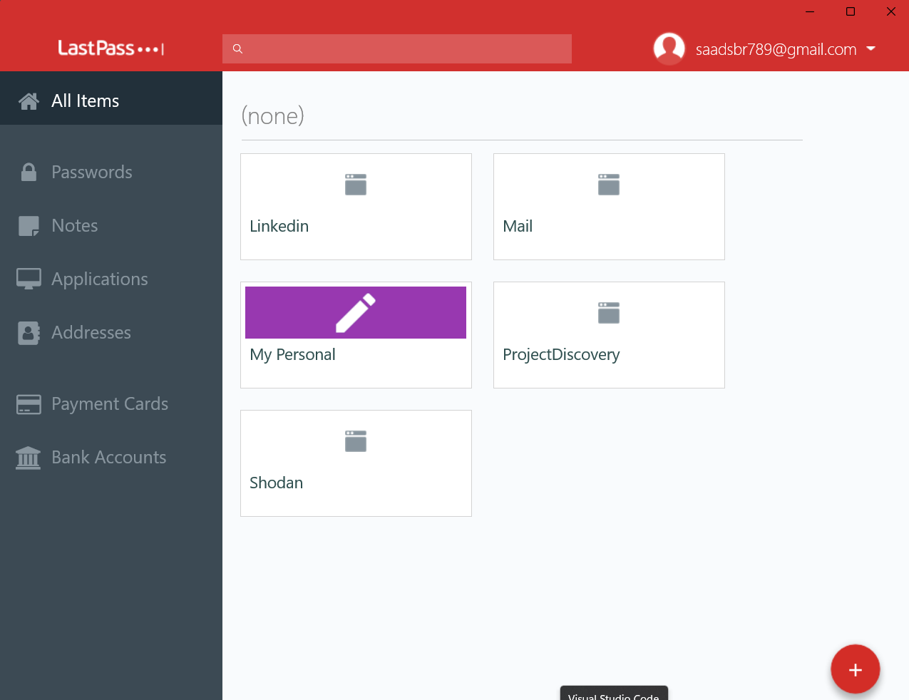

## **Task 1: Set Up Basic Firewall Rules**

Setting up a rewall is a crucial step in securing your network and protecting your data. A
rewall acts as a barrier between your internal network and external threats, ltering trac
and blocking potentially harmful connections. Here’s a guide to setting up basic rewall rules
eectively.

**Basic Firewall Rules**
Identify and allow only the necessary services. Common services might include:
- HTTP (Port 80) and HTTPS (Port 443) for web trac
- SMTP (Port 25) for email
- SSH (Port 22) for secure shell access

            

---

## **Task 2: Use a Password Manager**
LastPass is a popular password manager that helps you securely store and manage your
passwords. By using LastPass, you can generate strong passwords, autoll login credentials,
and keep your personal information safe. Here’s a step-by-step guide on how to use LastPass
eectively.

**Getting Started with LastPass**

1.  Create an Account:
- Visit the LastPass website and click on "Get LastPass Free" or "Start Free Trial" for the
premium version.
- Enter your email address and create a strong master password. This master password
will be the key to all your other passwords, so make sure it is complex and memorable.
2.  Download and Install:
- Download the LastPass browser extension for Chrome, Firefox, Safari, or any other
browser you use. Alternatively, you can install the LastPass app on your mobile device
from the App Store or Google Play.
3.  Set Up Your Vault:
- Once installed, log in to LastPass using your newly created account.
- Access your vault where you can start adding and managing your passwords. The vault
is your secure space for storing login credentials, secure notes, and other sensitive
information.

"            "

---

## **Task 3: Identifying Phishing Emails**
With the rise of digital communication, phishing emails have become a prevalent threat. They
are designed to trick recipients into revealing personal information or downloading malicious
software. Here’s how you can identify and protect yourself from phishing emails:

**Signs of a Phishing Email:**
1.  Suspicious Sender Address
2.  Generic Greetings
3.  Urgent or Threatening Language
4.  Poor Grammar and Spelling
5.  Unusual Attachments or Links
6.  Requests for Personal Information

**What to Do If You Suspect a Phishing Email:**
- Report It
- Delete It
- Change Your Passwords

---

@All The Tasks Submitted By Muhammad Saad Sabir (msaadsbr)
