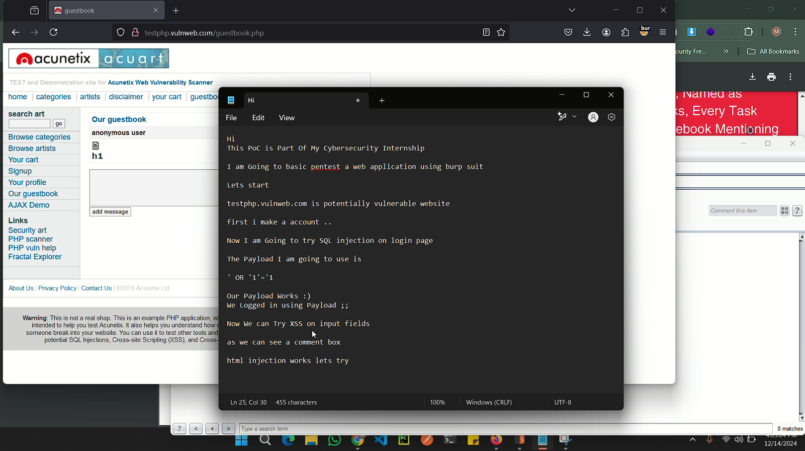
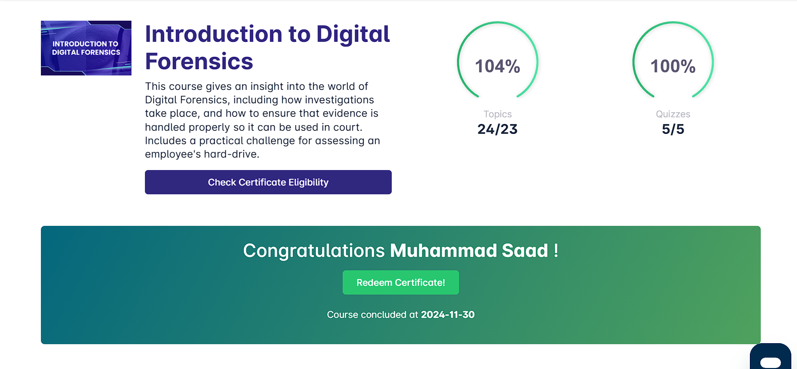

# **Task 1: Conduct A Penetration Task:**
testphp.vulnweb is potentially vulnerable website.

I have done some basic penetration on the website an successfully found:
- **XSS**
- **SQLI**

# **Task 2: Develop and Implement an Incident Response Plan:**
When it comes to forensics. I am very thankful for Security Blue that they make a very informational course.

I successfully completed all of their course modules and achieve the certificate :)

*I have also implement a Incident Response Plan Template which is also present in this repo*

# **Task 3 : Secure a Web Application**
When It Comes to Secure a Web Application the Headers Play An Important Part.

I have also tackle with Origin, HTTP requests, HSTS and etc during bug bounty.

In this image i show that how the origin header can cause BAC.

I have also find SQLI on Portswigger lab in which the category parameter is vulnerable

""
""

