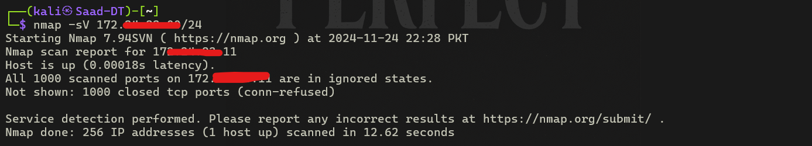
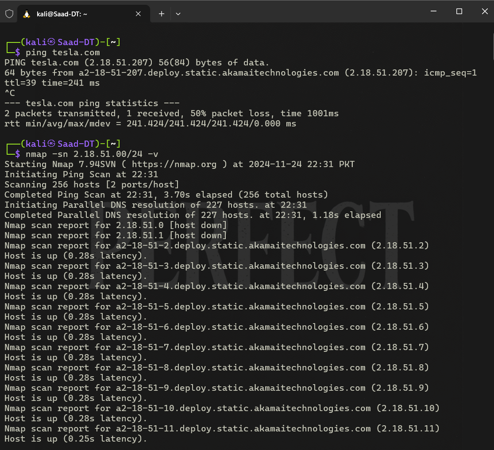
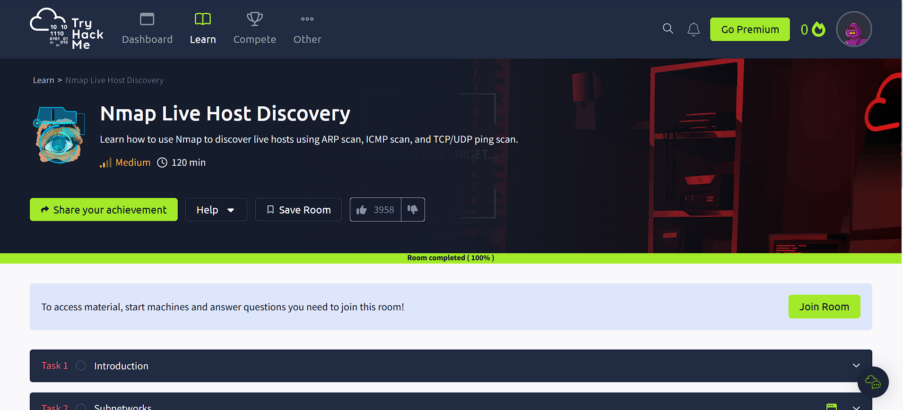
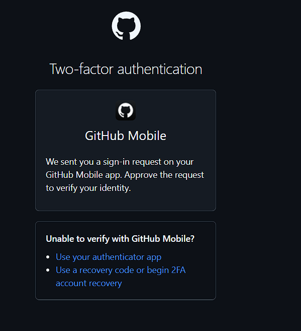
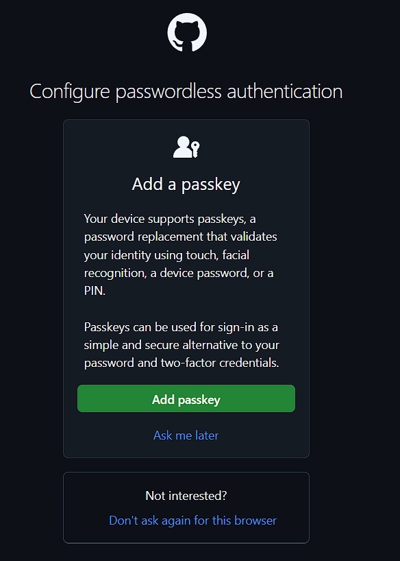
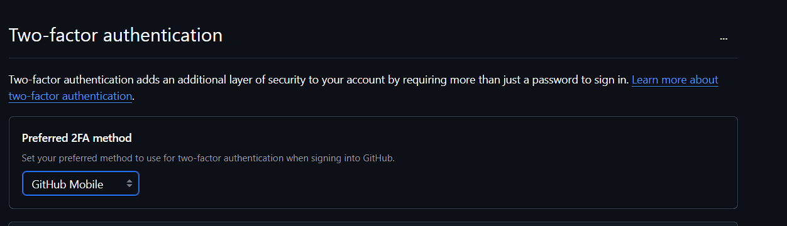
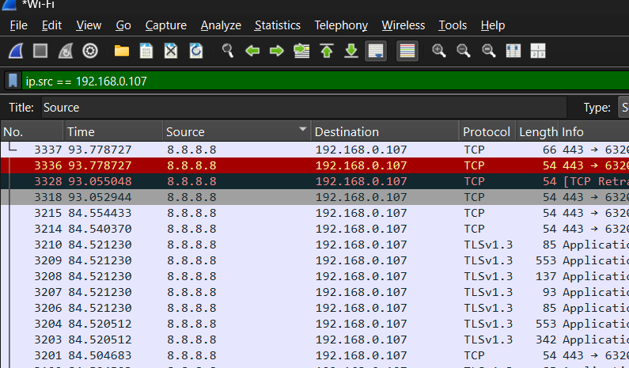
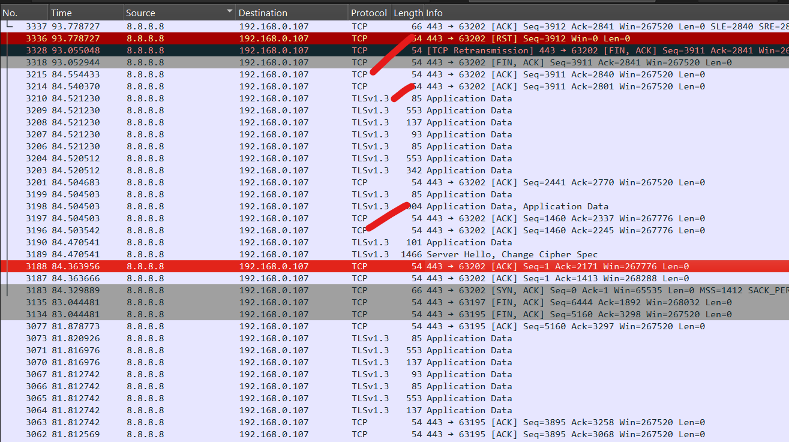

# **Task 1: Performing a Basic Vulnerability Scan**
Nmap (Network Mapper) is a powerful open-source tool used for network discovery and
security auditing. One of its features allows users to perform vulnerability scans to help
identify potential security risks in a network. Below is a step-by-step guide on how to perform
a basic vulnerability scan using Nmap.

**Install Nmap**

Before performing a vulnerability scan, ensure that Nmap is installed on your system. You can
download it from the ocial Nmap website and follow the installation instructions for your
operating system.

- **Windows**: Run the installer and follow the on-screen instructions.
- **Linux**: Use your package manager, e.g., sudo apt-get install nmap for Debian-based
systems.
- **macOS**: Use Homebrew, e.g., brew install nmap.

**Basic Command**

nmap -sV --script=vuln <target>
- -sV: Enables version detection, which is necessary for some vulnerability scripts.
- --script=vuln: Tells Nmap to run a category of scripts that check for vulnerabilities.
- <target>: Replace this with the IP address or domain name of the target.

""
""

---

# **Task 2: Implementing Two-Factor Authentication**

Two-Factor Authentication (2FA) adds an extra layer of security to your account by requiring
not just your password, but also a second piece of information to log in. This guide will walk
you through the steps to enable 2FA, ensuring your account is protected from unauthorized
access.

***Step-by-Step Guide to Enable 2FA***

**Access Your GitHub Account Settings**

1.  Log into GitHub: Start by logging into your GitHub account at github.com.
2.  Navigate to Settings: Click on your prole picture in the top-right corner, and from the
dropdown menu, select Settings.
3.  Security Settings: In the left sidebar of your settings page, click on Security.
4.  Enable 2FA: Under the Two-factor authentication section, click on the Enable two-factor
authentication button.

**Set Up Using an Authentication App**
1.  Install an Authenticator App: If you choose to use an app, ensure you have an
authenticator app installed on your smartphone.
2.  Scan the QR Code: GitHub will display a QR code. Open your authenticator app, and add
a new account by scanning this QR code.
3.  Enter Verication Code: The app will generate a 6-digit code. Enter this code on GitHub
to verify.

""
""

---

# **Task 3: Analyzing Network Traffic**
Wireshark is a powerful open-source tool used for network analysis and troubleshooting. It
allows users to capture and interactively browse the trac running on a computer network.
Whether you're a network administrator, cybersecurity professional, or a curious tech
enthusiast, understanding how to analyze network trac with Wireshark can be invaluable.

**Getting Started with Wireshark**

**Installation**
To begin analyzing network trac with Wireshark, you rst need to install it on your
computer. Wireshark is available on various platforms including Windows, macOS, and Linux.

Follow these steps to install:

1.  Download: Visit the Wireshark website and download the installer for your operating
system.
2.  Install: Run the downloaded installer and follow the installation wizard to complete the
setup.
3.  Launch: Open Wireshark after installation.

**Basic Interface Overview**
Upon opening Wireshark, you'll encounter its main interface which includes:

- Capture Interfaces: A list of available network interfaces that you can use to capture
traffic.
- Menu Bar: Provides access to various features and settings.
- Toolbar: Contains shortcuts for common tasks.
- Packet List Pane: Displays captured packets.
- Packet Details Pane: Shows detailed information of a selected packet.
- Packet Bytes Pane: Displays the raw data of a selected packet.

""

